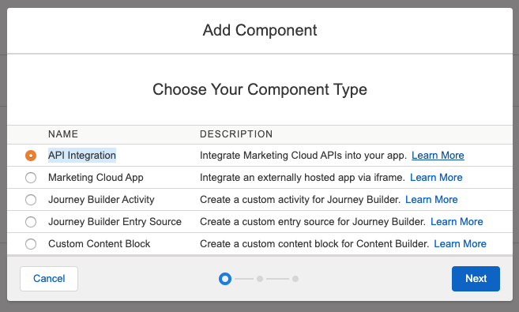
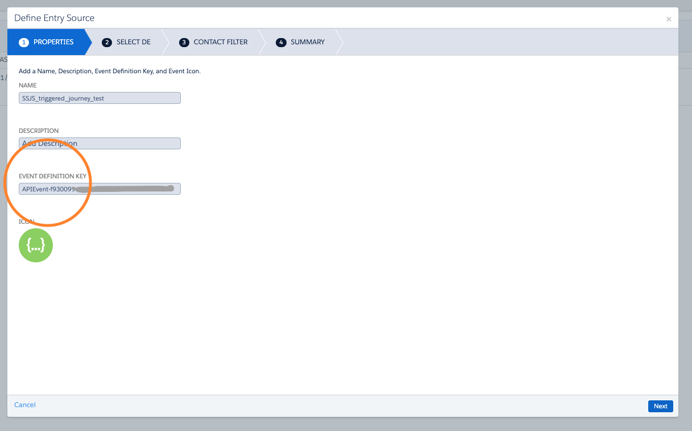

# SSJS HTTP POST IN SFMC

On Cloud Pages or in emails (using AMPscript) you may want to trigger a journey entry from a landing page, or script activity using Marketing Cloud REST API. Here is an example to request the authentification token that you will need to be authorized to perfom APIs calls. 


## Generating Client Id and Secret

In marketing Cloud : 

1. Go to `setup > Apps > Installed Packages`
2. Click on `new` to create a new package. Name it and enter a description
3. Once created click on `Add component` 
   
4. Le'ts create an [API Integration](https://developer.salesforce.com/docs/atlas.en-us.mc-app-development.meta/mc-app-development/api-integration.htm), pick `Server-to-Server` for instance 
5. Select the scope of your integration

> :bulb: In addition of the **Client Id** and **Client Secret**, you will find under the **REST Base URI** section, your custom URL that you'll use to for posting data.


## SSJS Request Token

### DEFINITION

| Ordinal | Type   |          | Description                                   |
| :------ | :----- | :------- | :-------------------------------------------- |
| **1**   | string | Required | Destination URL for the HTTP POST request     |
| **2**   | string | Required | Value to pass for the Content-Type header     |
| **3**   | string | Required | POST request content                          |
| **4**   | string | Required | Array of header names included in the request |

For the given call `var result = HTTP.Post(url, contentType, payload, headerNames, headerValues);`: 

- **URL** : [Request Token](https://developer.salesforce.com/docs/atlas.en-us.mc-getting-started.meta/mc-getting-started/requestToken.htm) URL
- **ContentType** : is `application/json` type
- **Payload** : will contain your client id and secret


### EXAMPLE REQUEST TOKEN

```html
<script runat="server">
    Platform.Load("Core", "1.1.1");
    try {
        var url = 'https://{YourCustomURI}.auth.marketingcloudapis.com/v1/requestToken';
        var contentType = 'application/json';
        var payload = '{"clientId": "{cliendIdHere}","clientSecret": "ClientSecretHere"}';
        var result = HTTP.Post(url, contentType, payload); // HTTP POST call with parameters
        var resultCode = (result.StatusCode); // Returns the execution code, check here for more info https://developer.salesforce.com/docs/atlas.en-us.mc-apis.meta/mc-apis/error-handling.htm
        var obj = Platform.Function.ParseJSON(result.Response + ''); // Parsing the JSON Response to get the token
        var val = obj.accessToken;
        var BearerT = 'Bearer ' + val;
        // Debug info below
        Write(resultCode + '<br>');
        Write(BearerT + '<br>');
        if (resultCode === 200) {
            // Another API call here or something else     
        } else {
            // block of code to be executed if the condition1 is false
        }
    } catch (ex) {
        Write("error message: " + ex);
    }
</script>
```

> :bulb: If you want to pass this token through another POST (withing the *if 200* area for instance)  you'll be able to put it into your 2nd post header. Example:
> ```javascript 
> var jbHeaderNames = ["Authorization"];
> var jbHeaderValues = [BearerT];
> var jbResult = HTTP.Post(jbUrl, jbContentType, jbPayload, jbHeaderNames, jbHeaderValues);
> ```


## SSJS Journey Builder API Entry Event

### JOURNEY API ENTRY SOURCE

You will need to create first an API entry event. To do so : 

1. Go in *Journey Builder* and click on `Entry Sources`
2. Click on `New Event`
3. Give it a name and a description them copy the `EVENT DEFINITION KEY` (you will need it into the API call later on)
   
4. Select the journey entry sendable data extension 
5. You can add a filter and then save.


### EXAMPLE FIRE EVENT HTTP POST

In this example we will retrieve the token that we requested in the query above. Our API call will use the [interaction/v1/events](https://developer.salesforce.com/docs/atlas.en-us.noversion.mc-apis.meta/mc-apis/postEvent.htm) REST API.

```javascript
if (resultCode === 200) {
  var jbUrl = 'https://{YourCustomUri}.rest.marketingcloudapis.com/interaction/v1/events';
  var jbContentType = 'application/json';
  // Below we'll detail the subscriber key, the API event and in data we will detail the DE info to populate.
  var jbPayloadPart = {
    "ContactKey": ssjsVarSubscriberkey,
    "EventDefinitionKey": "{YourJbEntrySourceApiEventHere}",
    "EstablishContactKey": true,
    "Data": {
      "YourDeSubscriberkeyField": ssjsVarSubscriberkey,
      "YourDeEmailAddressField": ssjsVarEmailAddress,
      "YourDeFirstNameField": ssjsVarFirstName
    }
  };
  var jbPayload = Stringify(jbPayloadPart); // Creating a API readable JSON payload
  var jbHeaderNames = ["Authorization"];
  var jbHeaderValues = [BearerT]; // Token we retrieved previously
  var jbResult = HTTP.Post(jbUrl, jbContentType, jbPayload, jbHeaderNames, jbHeaderValues);
  var jbResultCode = (jbResult.StatusCode);
  var jbStry = (jbResult.Response + '');
  Write(jbResultCode + '<br>');
} else {
  // block of code to be executed if the condition1 is false
}
```

> :bulb: You can retrieve the information to pass by retrieveing a URL parameter value, or form submission, or simply by using [lookup functions](https://developer.salesforce.com/docs/atlas.en-us.mc-programmatic-content.meta/mc-programmatic-content/ssjs_platformDataExtensionLookup.htm) for example. You can also do it with AMPscript as it uses the same functions. 


## Resources :link:

- [SSJS HTTP POST - official documentation](https://developer.salesforce.com/docs/atlas.en-us.mc-programmatic-content.meta/mc-programmatic-content/ssjs_httpPost.htm)
- [AMPscript HTTP POST - official documentation](https://developer.salesforce.com/docs/atlas.en-us.noversion.mc-programmatic-content.meta/mc-programmatic-content/httppost.htm)
- [Parse JSON SSJS function - official documentation](https://developer.salesforce.com/docs/atlas.en-us.mc-programmatic-content.meta/mc-programmatic-content/ssjs_platformUtilityParseJSON.htm)
- [Journey Builder Event REST API - official documentation](https://developer.salesforce.com/docs/atlas.en-us.noversion.mc-apis.meta/mc-apis/postEvent.htm)